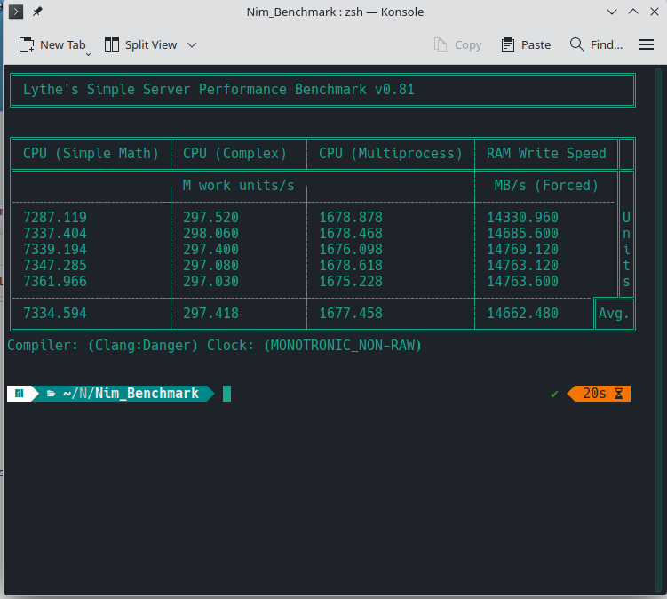

# Lythe's Simple Server Performance Benchmark

A lightweight, terminal-based CPU and memory benchmark focused on
repeatable, pessimistic, real-world performance characteristics
written with minimal abstraction and no-OOP.

## Benchmark Philosophy

This tool intentionally measures *pessimistic*, serialized workloads:

- CPU benchmarks prevent compiler optimizations
- No SIMD or vectorization is assumed
- Memory tests use sustained writes with cache pressure
- Results prioritize cross-OS and VM consistency

This is **not a peak FLOPS benchmark**.

## Benchmarks

### CPU (Simple Math)
Measures serialized integer operations with enforced memory visibility.
Score unit: Million Work Units / second.

### CPU (Complex)
Measures mixed integer, floating-point, and transcendental operations.

### CPU (Multiprocess)
Measures total CPU throughput across multiple processes.

### RAM Write Speed
Measures sustained memory write bandwidth using a fixed buffer.
Score unit: MB/s (decimal).

## Usage
Simply launch from terminal / CLI ` ./main ` and add options as desired.

### Options

| Option  | Description |
| ------------- |:-------------:|
| --skip-memory-test     | Skips RAM test     |
| --memory-buffer-size=##      | Sets memory buffer size for RAM test (Given in MB, default is 256)     |
| --disableLog      | Disables logging.     |
| --multiprocess-workers=## | Sets worker count for multiprocess scoring, default is 32, max is 256 |

## Supported Platforms
- Linux (Tested on RHEL 10 and Manjaro 25)
- FreeBSD (Tested on FreeBSD 15)
- OpenBSD

## Build Notes
Expect significant score differences in Simple Calc and RAM Write between GCC and Clang compiled binaries, precompiled builds use the recommended flags.

Recommended flags:

- `-d:release`
- `--threads:off`
- `--tlsemulation:off`

## Short FAQ
| Question  | Answer |
| ------------- |:-------------:|
| Is there a reason for only using a single main.nim file instead of splitting ? | Yes, I believe in it's current form it's more readable as a single file and easier to audit and follow flow since the code is still small and easier to understand, I'll consider splitting if the project ever grows beyond 900 lines or it becomes less linear but right now it feels premature.|
